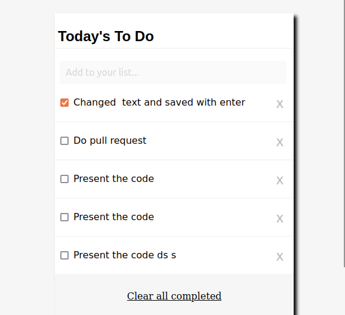
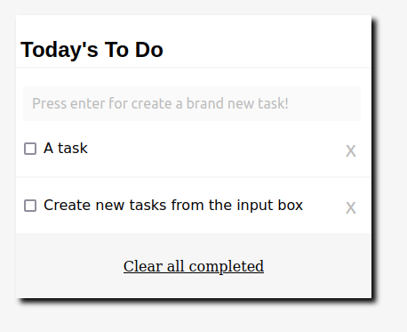

# To Do List

> A simple HTML list of To Do tasks



## Features

To Do List is a minimalist web app, but with all the functions that you need most for task management

### Create Tasks

Add text in the input box and press enter. The task will be ordered at the bottom.




### Edit tasks

Click the text area. When the task is highlighted, you can edit your text. Changes will be saved after pressing enter.


### Check tasks

Check and uncheck tast clicking the checkbox. 

### Clear all completed tasks

Remove all the tasks already done pressing the clear area

## Built With

- HTML/CSS
- JavaScript
- Webpack

## Live Demo

[Live Demo Link](https://raw.githack.com/Maclenn77/To-Do-List/main/dist/index.html)


## Getting Started

To get a local copy up and running follow these simple example steps.

### Prerequisites

- A web browser
- [NPM](https://webpack.js.org/)
- [Webpack configured](https://webpack.js.org/)

### Setup

- Clone the project from Github

```git clone repolink```


### Install

Once cloned, you can run it from your web browser from the dist version.

### Usage

- Do any change in the /src file
- Run npm to update dist from src
```npm run build```


### Deployment


## Authors

👤 **Author1**

- GitHub: [@Maclenn77](https://github.com/Maclenn77)
- Twitter: [@SrJuanPapas](https://twitter.com/SrJuanPapas)
- LinkedIn: [Juan Paulo Péreztejada](https://linkedin.com/in/juanpaulopereztejada)


## 🤝 Contributing

Contributions, issues, and feature requests are welcome!

Feel free to check the [issues page](https://github.com/Maclenn77/To-Do-List/issues).

## Show your support

Give a ⭐️ if you like this project!

## Acknowledgments

- Hat tip to anyone whose code was used
- Inspiration
- Microverse partners!

## 📝 License

This project is [MIT](./MIT.md) licensed.
